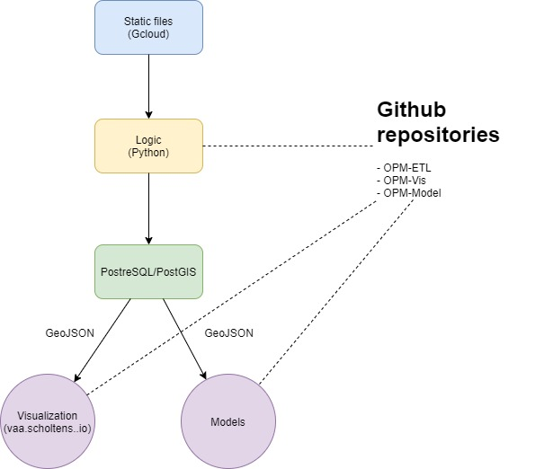

# Oak processionary moth data

## Goals
- Extract data 
- Reproducibility
    - A clean machine must be able to get exactly the same data as I'm working with.
    - Transparency of transformations made.
- Data quality
    - Use standards where possible
- Transparancy
    - METADATA from where each input originated.

## Architecture

### ETL 101

Primer on ETL
Extract

Transform
Transformation
Passthrough -> No transformations needed

Load

### Data architecture

### Software architecture(logic layer)

Constraints
From the stated goals and the primer on ETL the following constraints can be formulated.
- All calculations must be made in the transformation-layer
    - Extract-layer will simply download the file to the local machine.
    - Load-layer will read the final transformed file and load this into the database.

- To improve reproducability, readability every non-trivial transformation on a file will result in a new file.

- Data quality
    - Integrate checks which ensures: (pre-flight checks)
        - Is there a SQLAlchemy feature for this?
        - Otherwise intregrate in models
        - UTF-8
        - WSG84
        - Metereological metrics are in ...

- Granularity:
    - Each ETLConfigItem is bounded to <italic>one</italic> table.

## Maintenance
### Backup / restore
docker exec -t your-db-container pg_dumpall -c -U your-db-user | gzip > ./dump_$(date +"%Y-%m-%d_%H_%M_%S").gz
docker exec -t opm-etl_postgis_1  pg_dumpall -c -U tim | gzip > ./dump_$(date +"%Y-%m-%d_%H_%M_%S").gz
gunzip < your_dump.sql.gz | docker exec -i your-db-container psql -U your-db-user -d your-db-name
gunzip < dump_2021-02-05_16_32_52.gz | docker exec -i opm-etl_postgis_1  psql -U tim -d opm

## Justifications
### Why google cloud?
- Personal data, some research data is binded to me only. 
- Single source
    - No need for daily updating of data.
    - Some data sources are one-time delivery only.
    - Only one interface needed to build.

### Python libraries

#### Pathlib
- Cross platform compatibility
    - Developing on Windows + Ubuntu

## Data sources
- NDFF -> one time dump
- Bomenregister -> one time dump
- Calculation of BIOCLIM variables https://pubs.usgs.gov/ds/691/ds691.pdf
- Geographical_units
    - https://www.cbs.nl/nl-nl/dossier/nederland-regionaal/geografische-data/wijk-en-buurtkaart-2020
    - https://www.pdok.nl/introductie/-/article/cbs-provincies
- KNMI
    - http://projects.knmi.nl/klimatologie/daggegevens/selectie.cgi

