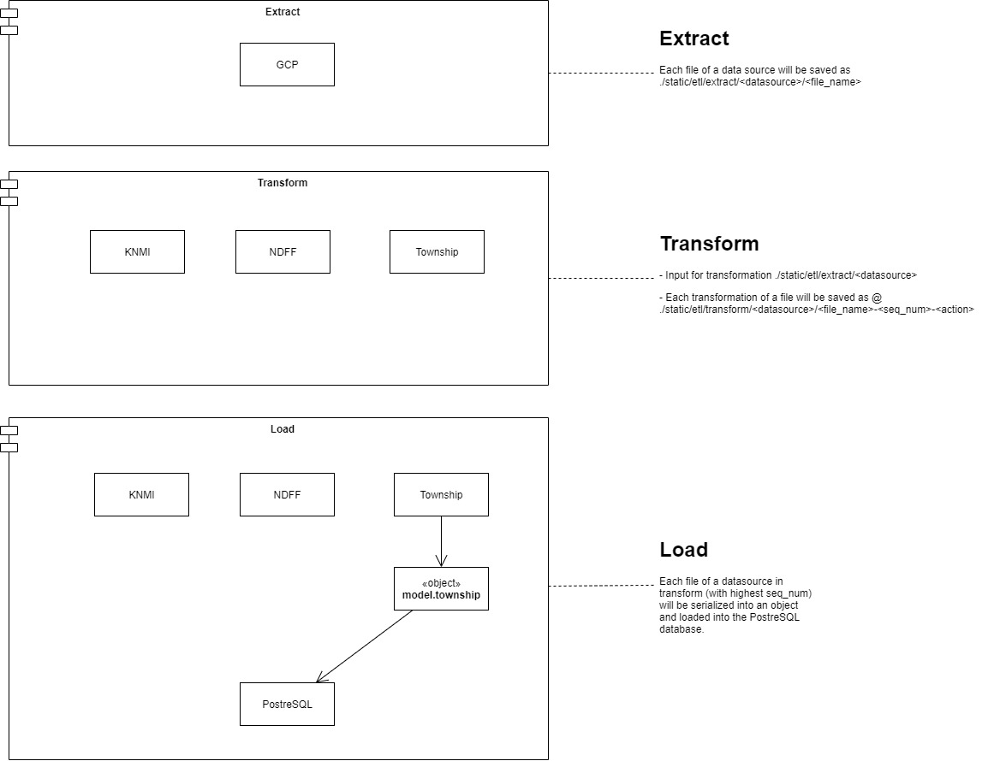

# Oak processionary moth data

## Goals
- Extract data 
- Reproducability
    - A clean machine must be able to get exactly the same data as I'm working with.
        - Transparency of transformations made.

### Reproducacility
- Keep libraries and python version fixed

## Architecture

### Data architecture

### Software architecture(logic layer)

## Justifications
### Why google cloud?
- Personal data
- Single source
    - No need for daily updating of data.
    - Some data sources are one-time delivery only.
    - Only one interface needed to build.

### Python libraries

#### Pathlib
- Cross platform compatibility
    - Developing on Windows + Ubuntu

## Data sources
- NDFF -> one time dump
- Bomenregister -> one time dump

